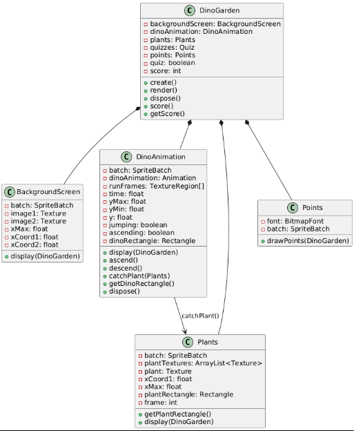

# DINOGARDEN :sauropod: 	:t-rex:

####   :pushpin: O jogo inspirado na fama dos dinossauros encontrados na Formação Geológica Santa Maria que abrange diversos municípos das proximidades, onde foram encontrados os fósseis mais antigos do mundo graças a formação antiga exposta na superfície devido a processos de erosão. Os queridos dinos são do período Triássico, cerca de 233 milhões de anos atrás :scream: .

####   :pushpin: Essa datação pode ser feita de acordo com decaimento de carbono e pela idade das rochas onde foram encontrados. Este trabalho é realizado por estudantes, professores e pesquisadores da Universidade Federal de Santa Maria que trabalham arduamente para resgatar esta importante parte da nossa história, sendo em campo ou no campus, e por falar em campus, nosso querido dino se interessou tanto pelo trabalho da universidade que resolveu dar uma voltinha pela universidade e acabou se perdendo e pelo Jardim Botânico da Universidade. Para conseguir encontrar o caminho de volta ele precisa, assim como nós, estudar e descobrir o nome das plantas do Jardim Botânico :seedling: e responder a algumas perguntas, e pede sua ajuda para ajudá-lo nessa missão :grin:.


### O jogabilidade é bem simples!!

:point_right: Click do mouse para o dino pular e pegar as frutinhas;
  
:point_right: Ao abrir o Quizz, clique na resposta correta.


### Você terá algumas chances de acertar as perguntas, caso não conseguir não desista e tente novamente!


Para rodar o jogo você precisa clonar este respositório, navegar até a raíz do projeto e executar os comandos: 
- ```./gradlew build ```
- ```./gradlew run ```


#### Após isso é só jogar e se divertir 💚


### DIAGRAMA DE CLASSES:



#### Configurações técnicas:
- openjdk version "17.0.13" 2024-10-15
- Framework LIBGDX 1.13.0.1


#### :small_blue_diamond: O jogo foi desenvolvido utilizando a LIBGDX, um framework java para desenvolvimento de jogos baseado em OpenGL com suporte a web, VScode como ambiente de desenvolvimento, auxilío da documentação disponível no site da LIBGDX e material de aula disponibilizado pela professora.

#### :small_blue_diamond: O desenvolvimento foi separado nas integrantes do grupo em:

#### :green_circle: Desenvolvimento da Lógica Principal
  Foram utilizados tutoriais para a animação do fundo (https://www.youtube.com/watch?v=UyNm3n1WNAA) e da movimentação do dinossauro (https://libgdx.com/wiki/graphics/2d/2d-animation).
  As imagens foram obtidas em sites de distribuição gratuita (dinossauro e plantas: https://opengameart.org/content/free-dino-sprites; e plano de fundo: https://wallpapercave.com/2d-games-wallpapers).
  O desenvolvimento da lógica principal seguiu uma abordagem bottom-up: precisamos de um fundo, precisamos de um personagem, precisamos de uma ação, e assim sucessivamente. 
  Isso acarretou na falta de tempo para refatorar as classes, gerando redundâncias e classes que poderiam ter sido generalizadas e herdadas.

#### :green_circle: Desenvolvimento do QUIZ

   O quiz foi baseado na reutilização do código quizGame de MinAntak disponível no GitHub em https://github.com/MinAntak/quizGame.
Para reutilizar foram feitas adaptações da versão da LIBGDX e do Java para executar nas versões atuais, mudança no arquivo de perguntas, mudança nos assets para utilizar as imagens das plantas e adaptações como línguagem, dimensão, etc.
  As imagens do quiz foram captadas *in loco* durante uma visita ao Jardim Botânico.


### :x: ERROS TÉCNICOS

Problemas principalmente na integração do jogo, entre o Quiz e o Jogo principal. Demora para compreender a diferença entre classes da LIBGDX e o funcionamento da lógica geral.


###  :white_check_mark: ACERTOS E APRENDIZADO

O trabalho desenvolvido foi de grande valia para as intregrantes pois possibilitou aprimorar diversos aspectos como a Orientação a Objetos, utilização de um Framework, a própria linguagem de programação, desenvolvimento em conjunto, reutilização de código (leitura e interpretação).


### :small_blue_diamond: CONSIDERAÇÕES FINAIS

O jogo não está funcionando como o esperado pois tivemos problemas de integração visto que foram desenvolvidas as partes paralelamente, além da pouca familiaridade com o Framework. Porém podemos citar diversos pontos positivos e resolução de problemas como tratamento dos problemas com imagem, contadores, etc. 

A disciplina nos ofereceu uma oportunidade de trabalho em equipe em desenvolvimento, mostrando-se preparatória para mercado de trabalho, além da utilização de códigos de terceiros que exigem leitura e compreensão.

Nossos agradeciementos a professora pelo semestre, pelos aprendizados e oportunidades, pelos colegas, pelas apresentações.


### :small_blue_diamond: REFERÊNCIAS

- Imagens das plantas de autoria própria;

- Utilização do ChatGPT para auxílio na interpretação de código e busca por erros e solução de versão;

- [Documentação da LIBGDX](https://libgdx.com/dev/)

- [Quizz de MinAntak](https://github.com/MinAntak/quizGame)

- [Material da disciplina](https://github.com/AndreaInfUFSM/elc117-2024b)

- [Material sobre dinossauros em Santa Maria](https://diariosm.com.br/noticias/geral/regiao_de_santa_maria_entra_para_o_guinness_como_o_berco_dos_dinossauros_mais_antigos_do_mundo.455469)

- Diagrama gerado no PlantUML


